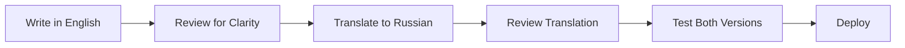

# Team Language Policy Guide

## 📋 Policy Summary

**Effective Date:** January 2025  
**Policy Version:** 2.1  
**Primary Language:** English  
**Secondary Language:** Russian

## 🎯 Core Principles

### 1. **Development Language: English Only**
```yaml
Required in English:
  - All source code and comments
  - Git commit messages
  - Pull request descriptions
  - Technical documentation
  - API documentation
  - Configuration files
  - README files
  - Issue descriptions
```

### 2. **User-Facing Content: Bilingual**
```yaml
Bilingual (English primary, Russian secondary):
  - Website content
  - User interface text
  - Error messages
  - Help documentation
  - Marketing materials
```

### 3. **Internal Communication: Flexible**
```yaml
Team Communication:
  - Meetings: Flexible (Russian comfortable for team)
  - Slack/Chat: Flexible
  - Code Reviews: English preferred
  - Architecture Discussions: English preferred
```

## 🔄 Migration Guidelines

### Immediate Changes (This Week):
- **New Code:** All new code must use English comments
- **Commit Messages:** Switch to English immediately
- **New Documentation:** Write in English

### Gradual Migration (Next Month):
- **Existing Comments:** Update during regular maintenance
- **Old Documentation:** Translate high-priority docs first
- **Legacy Content:** Update as you work on related features

### Don't Change (Grandfathered):
- **Existing Russian Comments:** Update only when modifying the file
- **Historical Commit Messages:** Leave as-is
- **User-Facing Russian Content:** Keep and maintain

## 📝 Writing Guidelines

### Code Comments:
```javascript
// ✅ GOOD: Calculate user authentication token expiry
const tokenExpiry = Date.now() + (24 * 60 * 60 * 1000);

// ❌ BAD: Вычисляем срок действия токена аутентификации
const tokenExpiry = Date.now() + (24 * 60 * 60 * 1000);
```

### Commit Messages:
```bash
# ✅ GOOD:
git commit -m "feat: add user authentication validation"
git commit -m "fix: resolve memory leak in translation cache"
git commit -m "docs: update API documentation for v2.1"

# ❌ BAD:
git commit -m "добавил валидацию пользователей"
git commit -m "исправил утечку памяти"
```

### Pull Request Descriptions:
```markdown
✅ GOOD:
## Summary
Add bilingual support for error messages

## Changes
- Implement translation system for error codes
- Add Russian translations for common errors
- Update error handling middleware

## Testing
- Verify error messages display in correct language
- Test language switching functionality

❌ BAD:
## Описание
Добавил поддержку двух языков для сообщений об ошибках
```

### Documentation Structure:
```markdown
✅ GOOD:
# API Documentation

## Authentication Endpoints

### POST /api/auth/login
...

❌ BAD:
# Документация API

## Эндпоинты аутентификации
```

## 🌐 Translation Guidelines

### For User-Facing Content:

1. **Primary (English) Content:**
   - Write first in English
   - Use clear, simple language
   - Avoid complex idioms or colloquialisms
   - Consider international English audience

2. **Secondary (Russian) Content:**
   - Translate from English version
   - Maintain consistent terminology
   - Use professional, respectful tone
   - Ensure cultural appropriateness

### Translation Workflow:


## 🛠️ Tools & Support

### Language Tools:
- **Grammarly:** For English grammar and style
- **Google Translate:** For initial translation drafts
- **DeepL:** For more nuanced translations
- **Yandex.Translate:** For Russian-specific context

### IDE Configuration:
```json
// VS Code / Cursor settings
{
  "cSpell.language": "en,ru",
  "cSpell.enableFiletypes": ["javascript", "markdown"],
  "editor.rulers": [80, 120],
  "editor.wordWrap": "wordWrapColumn",
  "editor.wordWrapColumn": 80
}
```

### Helpful Resources:
- **Microsoft Style Guide:** English technical writing
- **Google Developer Documentation Style Guide**
- **Russian Technical Writing Guide:** For user-facing content

## 📊 Quality Assurance

### Automated Checks:
- **ESLint Rules:** Detect non-English comments (custom rule)
- **Commit Hooks:** Validate commit message language
- **PR Templates:** Require English descriptions
- **Documentation Linting:** Check for consistent language use

### Manual Reviews:
- **Code Reviews:** Verify comment language
- **Translation Reviews:** Native speaker validation
- **Documentation Reviews:** Technical writer approval

## 🎓 Team Training

### Onboarding for New Team Members:
1. **Policy Orientation:** Review this document
2. **Practice Session:** Write sample code/commits
3. **Mentorship:** Pair with experienced team member
4. **Resources:** Access to language learning tools

### Ongoing Support:
- **Weekly Language Tips:** Share in team channel
- **Translation Help:** Team members assist each other
- **External Resources:** Budget for language training
- **Style Guide Updates:** Regular policy refinements

## 📈 Success Metrics

Track language policy adoption:

### Code Quality:
- **Comment Language Compliance:** Target 95%+ English
- **Commit Message Compliance:** Target 100% English
- **Documentation Consistency:** Regular audits

### User Experience:
- **Translation Completeness:** Track missing translations
- **Language Switch Functionality:** Monitor user behavior
- **Content Quality:** User feedback on clarity

### Team Productivity:
- **Onboarding Time:** Measure new developer efficiency
- **Code Review Speed:** Track review and merge times
- **Documentation Usage:** Monitor help system usage

## ❓ FAQ

### Q: What if I'm not confident in my English writing?
**A:** Use simple, clear sentences. It's better to be clear than perfect. Team members and tools can help improve writing quality.

### Q: Should variable names be in English?
**A:** Yes, always. Use descriptive English variable and function names.

### Q: What about error messages users see?
**A:** Error messages should be bilingual - implement through the translation system.

### Q: Can I write design documents in Russian?
**A:** Technical design documents should be in English. User experience documents can be bilingual.

### Q: How do I handle Russian-specific features?
**A:** Code and documentation in English, but comments can explain Russian-specific context.

### Q: What if a client requests documentation in Russian?
**A:** Create separate Russian documentation, but keep the master technical docs in English.

## 📞 Getting Help

### Language Support:
- **Team Chat:** #language-help channel
- **1:1 Support:** Schedule with English-proficient team members
- **External Resources:** Company-sponsored language learning
- **Tools:** Grammar checking software access

### Technical Questions:
- **Implementation:** How to implement bilingual features
- **Translation:** Best practices for content translation
- **Tooling:** Setting up language validation tools

### Policy Questions:
- **Clarifications:** When policy isn't clear
- **Exceptions:** Requesting temporary exceptions
- **Updates:** Suggesting policy improvements

---

**Remember:** This policy aims to improve code maintainability, team collaboration, and international accessibility. It's about growth and improvement, not perfection from day one! 🚀
