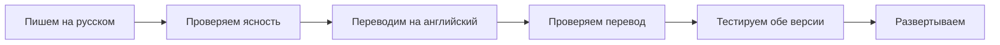

# Языковая политика команды / Team Language Policy

## 📋 Краткое изложение политики / Policy Summary

**Дата вступления в силу:** Январь 2025 / **Effective Date:** January 2025  
**Версия политики:** 2.2 / **Policy Version:** 2.2  
**Основной язык:** Русский / **Primary Language:** Russian  
**Дополнительный язык:** Английский / **Secondary Language:** English

---

## 🎯 Основные принципы / Core Principles

### 1. **Язык разработки: Русский предпочтителен / Development Language: Russian Preferred**

```yaml
Требуется на русском / Required in Russian:
  - Комментарии в исходном коде / Source code comments
  - Сообщения коммитов Git / Git commit messages  
  - Описания Pull Request'ов / Pull request descriptions
  - Техническая документация / Technical documentation
  - Документация API / API documentation
  - Конфигурационные файлы / Configuration files
  - README файлы / README files
  - Описания Issue / Issue descriptions
```

### 2. **Контент для пользователей: Двуязычный / User-Facing Content: Bilingual**

```yaml
Двуязычный (русский основной, английский дополнительный) / Bilingual (Russian primary, English secondary):
  - Контент веб-сайта / Website content
  - Текст пользовательского интерфейса / User interface text
  - Сообщения об ошибках / Error messages
  - Справочная документация / Help documentation
  - Маркетинговые материалы / Marketing materials
```

### 3. **Внутренняя коммуникация: Гибко / Internal Communication: Flexible**

```yaml
Коммуникация команды / Team Communication:
  - Встречи: Гибко (русский удобен для команды) / Meetings: Flexible (Russian comfortable for team)
  - Slack/Чат: Гибко / Slack/Chat: Flexible
  - Code Review: Русский предпочтителен / Code Reviews: Russian preferred
  - Обсуждения архитектуры: Русский предпочтителен / Architecture Discussions: Russian preferred
```

---

## 🔄 Руководство по миграции / Migration Guidelines

### Немедленные изменения (эта неделя) / Immediate Changes (This Week):
- **Новый код:** Все новые комментарии должны быть на русском / **New Code:** All new comments must be in Russian
- **Сообщения коммитов:** Немедленно переход на русский / **Commit Messages:** Switch to Russian immediately
- **Новая документация:** Пишите на русском / **New Documentation:** Write in Russian

### Постепенная миграция (следующий месяц) / Gradual Migration (Next Month):
- **Существующие комментарии:** Обновляйте во время регулярного обслуживания / **Existing Comments:** Update during regular maintenance
- **Старая документация:** Сначала переводите высокоприоритетную документацию / **Old Documentation:** Translate high-priority docs first
- **Устаревший контент:** Обновляйте при работе с связанными функциями / **Legacy Content:** Update as you work on related features

### Не изменяйте (дедовщина) / Don't Change (Grandfathered):
- **Существующие английские комментарии:** Обновляйте только при изменении файла / **Existing English Comments:** Update only when modifying the file
- **Исторические сообщения коммитов:** Оставляйте как есть / **Historical Commit Messages:** Leave as-is
- **Пользовательский английский контент:** Сохраняйте и поддерживайте / **User-Facing English Content:** Keep and maintain

---

## 📝 Руководство по написанию / Writing Guidelines

### Комментарии в коде / Code Comments:

```javascript
// ✅ ХОРОШО: Вычисляем время истечения токена аутентификации пользователя
const tokenExpiry = Date.now() + (24 * 60 * 60 * 1000);

// ❌ ПЛОХО: Calculate user authentication token expiry time
const tokenExpiry = Date.now() + (24 * 60 * 60 * 1000);
```

### Сообщения коммитов / Commit Messages:

```bash
# ✅ ХОРОШО:
git commit -m "feat: добавить валидацию аутентификации пользователя"
git commit -m "fix: исправить утечку памяти в кэше переводов"
git commit -m "docs: обновить документацию API для версии 2.1"

# ❌ ПЛОХО:
git commit -m "feat: add user authentication validation"
git commit -m "fix: resolve memory leak in translation cache"
```

### Описания Pull Request'ов / Pull Request Descriptions:

```markdown
✅ ХОРОШО:
## Краткое описание
Добавление двуязычной поддержки для сообщений об ошибках

## Изменения
- Реализация системы переводов для кодов ошибок
- Добавление русских переводов для распространённых ошибок
- Обновление middleware обработки ошибок

## Тестирование
- Проверка отображения сообщений об ошибках на правильном языке
- Тестирование функциональности переключения языка

❌ ПЛОХО:
## Summary
Add bilingual support for error messages

## Changes
- Implement translation system for error codes
- Add Russian translations for common errors
```

### Структура документации / Documentation Structure:

```markdown
✅ ХОРОШО:
# Документация API

## Эндпоинты аутентификации

### POST /api/auth/login
...

❌ ПЛОХО:
# API Documentation

## Authentication Endpoints
```

---

## 🌐 Руководство по переводам / Translation Guidelines

### Для контента пользователей / For User-Facing Content:

1. **Основной контент (русский) / Primary Content (Russian):**
   - Сначала пишите на русском / Write first in Russian
   - Используйте ясный, простой язык / Use clear, simple language
   - Избегайте сложных идиом или разговорной речи / Avoid complex idioms or colloquialisms
   - Учитывайте российскую аудиторию / Consider Russian audience

2. **Дополнительный контент (английский) / Secondary Content (English):**
   - Переводите с русской версии / Translate from Russian version
   - Поддерживайте консистентную терминологию / Maintain consistent terminology
   - Используйте профессиональный, уважительный тон / Use professional, respectful tone
   - Обеспечивайте культурную уместность / Ensure cultural appropriateness

### Рабочий процесс перевода / Translation Workflow:



---

## 🛠️ Инструменты и поддержка / Tools & Support

### Языковые инструменты / Language Tools:
- **Grammarly:** Для русской грамматики и стиля / For Russian grammar and style
- **Google Translate:** Для первоначальных черновиков перевода / For initial translation drafts
- **DeepL:** Для более тонких переводов / For more nuanced translations
- **Яндекс.Переводчик:** Для русскоязычного контекста / For Russian-specific context

### Настройка IDE / IDE Configuration:

```json
// Настройки VS Code / Cursor
{
  "cSpell.language": "ru,en",
  "cSpell.enableFiletypes": ["javascript", "markdown"],
  "editor.rulers": [80, 120],
  "editor.wordWrap": "wordWrapColumn",
  "editor.wordWrapColumn": 80
}
```

### Полезные ресурсы / Helpful Resources:
- **Microsoft Style Guide:** Техническое письмо на русском языке / Russian technical writing
- **Google Developer Documentation Style Guide**
- **Справочник по русскому техническому письму** / Russian Technical Writing Guide

---

## 📊 Обеспечение качества / Quality Assurance

### Автоматические проверки / Automated Checks:
- **Правила ESLint:** Обнаружение не-русских комментариев (пользовательское правило) / Detect non-Russian comments (custom rule)
- **Хуки коммитов:** Валидация языка сообщений коммитов / Validate commit message language
- **Шаблоны PR:** Требуют русские описания / Require Russian descriptions
- **Линтинг документации:** Проверка консистентного использования языка / Check for consistent language use

### Ручные проверки / Manual Reviews:
- **Code Review:** Проверка языка комментариев / Verify comment language
- **Проверки переводов:** Валидация носителем языка / Native speaker validation
- **Проверки документации:** Одобрение технического писателя / Technical writer approval

---

## 🎓 Обучение команды / Team Training

### Адаптация для новых членов команды / Onboarding for New Team Members:
1. **Ориентация по политике:** Изучение этого документа / **Policy Orientation:** Review this document
2. **Практическая сессия:** Написание примеров кода/коммитов / **Practice Session:** Write sample code/commits
3. **Наставничество:** Работа в паре с опытным членом команды / **Mentorship:** Pair with experienced team member
4. **Ресурсы:** Доступ к инструментам изучения языка / **Resources:** Access to language learning tools

### Постоянная поддержка / Ongoing Support:
- **Еженедельные языковые советы:** Делитесь в командном канале / **Weekly Language Tips:** Share in team channel
- **Помощь с переводами:** Члены команды помогают друг другу / **Translation Help:** Team members assist each other
- **Внешние ресурсы:** Бюджет на языковое обучение / **External Resources:** Budget for language training
- **Обновления руководства по стилю:** Регулярные уточнения политики / **Style Guide Updates:** Regular policy refinements

---

## 📈 Метрики успеха / Success Metrics

Отслеживание принятия языковой политики / Track language policy adoption:

### Качество кода / Code Quality:
- **Соответствие языка комментариев:** Цель 95%+ русский / **Comment Language Compliance:** Target 95%+ Russian
- **Соответствие сообщений коммитов:** Цель 100% русский / **Commit Message Compliance:** Target 100% Russian
- **Консистентность документации:** Регулярные аудиты / **Documentation Consistency:** Regular audits

### Пользовательский опыт / User Experience:
- **Полнота переводов:** Отслеживание отсутствующих переводов / **Translation Completeness:** Track missing translations
- **Функциональность переключения языка:** Мониторинг поведения пользователей / **Language Switch Functionality:** Monitor user behavior
- **Качество контента:** Отзывы пользователей о ясности / **Content Quality:** User feedback on clarity

### Продуктивность команды / Team Productivity:
- **Время адаптации:** Измерение эффективности новых разработчиков / **Onboarding Time:** Measure new developer efficiency
- **Скорость проверки кода:** Отслеживание времени проверки и слияния / **Code Review Speed:** Track review and merge times
- **Использование документации:** Мониторинг использования системы помощи / **Documentation Usage:** Monitor help system usage

---

## ❓ Часто задаваемые вопросы / FAQ

### В: Что если я не уверен в своих навыках русского письма?
**О:** Используйте простые, ясные предложения. Лучше быть ясным, чем идеальным. Члены команды и инструменты могут помочь улучшить качество письма.

### Q: What if I'm not confident in my Russian writing skills?
**A:** Use simple, clear sentences. It's better to be clear than perfect. Team members and tools can help improve writing quality.

### В: Должны ли имена переменных быть на русском?
**О:** Да, всегда. Используйте описательные русские имена переменных и функций.

### Q: Should variable names be in Russian?
**A:** Yes, always. Use descriptive Russian variable and function names.

### В: Что насчёт сообщений об ошибках, которые видят пользователи?
**О:** Сообщения об ошибках должны быть двуязычными - реализуйте через систему переводов.

### Q: What about error messages users see?
**A:** Error messages should be bilingual - implement through the translation system.

### В: Могу ли я писать проектные документы на русском?
**О:** Технические проектные документы должны быть на русском. Документы пользовательского опыта могут быть двуязычными.

### Q: Can I write design documents in Russian?
**A:** Technical design documents should be in Russian. User experience documents can be bilingual.

### В: Как обращаться с русскоспецифичными функциями?
**О:** Код и документация на русском, но комментарии могут объяснять русскоспецифичный контекст.

### Q: How do I handle Russian-specific features?
**A:** Code and documentation in Russian, but comments can explain Russian-specific context.

### В: Что если клиент запрашивает документацию на английском?
**О:** Создайте отдельную английскую документацию, но ведите мастер техническую документацию на русском.

### Q: What if a client requests documentation in English?
**A:** Create separate English documentation, but keep the master technical docs in Russian.

---

## 📞 Получение помощи / Getting Help

### Языковая поддержка / Language Support:
- **Командный чат:** Канал #language-help / **Team Chat:** #language-help channel
- **Индивидуальная поддержка:** Запланируйте встречу с членами команды, владеющими русским / **1:1 Support:** Schedule with Russian-proficient team members
- **Внешние ресурсы:** Спонсируемое компанией изучение языка / **External Resources:** Company-sponsored language learning
- **Инструменты:** Доступ к программному обеспечению проверки грамматики / **Tools:** Grammar checking software access

### Технические вопросы / Technical Questions:
- **Реализация:** Как реализовать двуязычные функции / **Implementation:** How to implement bilingual features
- **Перевод:** Лучшие практики для перевода контента / **Translation:** Best practices for content translation
- **Инструменты:** Настройка инструментов валидации языка / **Tooling:** Setting up language validation tools

### Вопросы политики / Policy Questions:
- **Разъяснения:** When policy isn't clear / Когда политика неясна
- **Исключения:** Requesting temporary exceptions / Запрос временных исключений
- **Обновления:** Suggesting policy improvements / Предложение улучшений политики

---

**Помните:** Эта политика направлена на улучшение поддерживаемости кода, командной коллаборации и доступности для российской аудитории. Речь идёт о росте и улучшении, а не о совершенстве с первого дня! 

**Remember:** This policy aims to improve code maintainability, team collaboration, and accessibility for Russian audiences. It's about growth and improvement, not perfection from day one! 🚀
