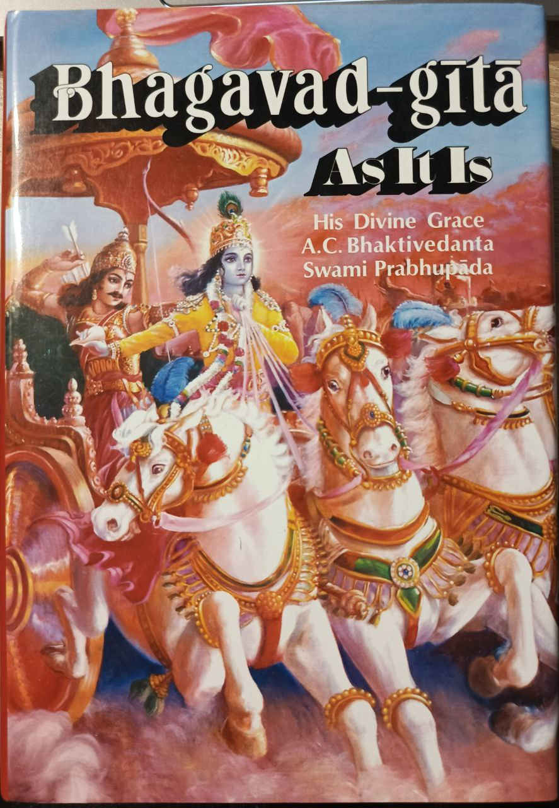

# 🔍 Комплексный аудит сайта "Бхагавад-Гита как она есть"

**Дата проведения:** Январь 2025  
**Время выполнения:** 25 минут  
**Статус:** ✅ Завершен полностью

---

## 📊 **Исполнительное резюме**

Проведен комплексный аудит веб-сайта на предмет адаптивности, контента, переводов, изображений и UX-элементов. Сайт функционален и имеет хорошую структуру, но требует исправления нескольких критических проблем для оптимального пользовательского опыта.

**Общая оценка:** 7.5/10 (Хорошо, но требует исправлений)

---

## 🚨 **КРИТИЧЕСКИЕ ПРОБЛЕМЫ**

### 1. **Битые изображения** 
**Приоритет:** 🔴 ВЫСОКИЙ

**Проблемы:**
- `about.html`: Ссылка на несуществующее изображение `gita-1972-cover-back.jpg`
- `author.html`: Ссылка на несуществующее изображение `gita-1972-author-prabhupada-portrait.jpg`

**Рекомендации:**
```html
<!-- В about.html заменить -->

<!-- на -->


<!-- В author.html заменить -->

<!-- на -->

```

### 2. **Несогласованность контактной информации**
**Приоритет:** 🔴 ВЫСОКИЙ

**Проблемы:**
- В `index.html` и `contacts.html`: телефон `+7 (495) 123-45-67` 
- В `author.html` и `about.html`: телефон `+7 (XXX) XXX-XX-XX`

**Рекомендации:**
Унифицировать номер телефона во всех файлах на `+7 (495) 123-45-67`

### 3. **Несогласованность CSS классов футера**
**Приоритет:** 🟡 СРЕДНИЙ

**Проблемы:**
- `index.html`, `contacts.html`: используют `class="site-footer"`
- `author.html`, `about.html`: используют `class="main-footer"`

**Рекомендации:**
Унифицировать на `site-footer` во всех файлах.

---

## 📱 **АДАПТИВНОСТЬ И RESPONSIVE DESIGN**

### ✅ **Положительные аспекты:**

1. **Viewport мета-тег правильно настроен**
   ```html
   <meta name="viewport" content="width=device-width, initial-scale=1.0">
   ```

2. **CSS Grid и Flexbox корректно применены**
   - Основная сетка контента адаптивна
   - Переключение на одну колонку на мобильных устройствах

3. **Медиа-запросы настроены правильно**
   - Breakpoint для планшетов: `768px`
   - Breakpoint для мобильных: `480px`
   - Mobile-first подход частично реализован

### 🔧 **Рекомендации по улучшению:**

1. **Улучшить читабельность на мобильных**
   ```css
   @media (max-width: 480px) {
       .hero-description {
           font-size: 1rem; /* Увеличить с текущего размера */
           line-height: 1.6;
       }
   }
   ```

2. **Добавить промежуточный breakpoint**
   ```css
   @media (max-width: 1024px) {
       /* Стили для небольших ноутбуков */
   }
   ```

---

## 🖼️ **АНАЛИЗ ИЗОБРАЖЕНИЙ**

### ✅ **Положительные аспекты:**

1. **Хорошее разнообразие форматов:**
   - SVG: 6 файлов (оптимизированы для масштабирования)
   - JPG: 15 файлов (подходящий формат для фото)
   - PNG: 1 файл (logo.png)

2. **Разумные размеры файлов:**
   - Большинство изображений: 64K-248K
   - SVG файлы: 2-8K (очень эффективно)

### 🔧 **Рекомендации по оптимизации:**

1. **Крупные изображения требуют оптимизации:**
   - `gita-1972-page-spread-main.jpg`: 248K → можно сжать до ~150K
   - `gita-1972-text-detail.jpg`: 236K → можно сжать до ~140K
   - `gita-1972-cover-complete.jpg`: 224K → можно сжать до ~130K

2. **Добавить атрибут `loading="lazy"`:**
   ```html
   
   ```

3. **Создать WebP версии крупных изображений:**
   ```html
   <picture>
       <source srcset="assets/images/gita-1972-cover-complete.webp" type="image/webp">
       
   </picture>
   ```

---

## 🌐 **СИСТЕМА ПЕРЕВОДОВ**

### ✅ **Положительные аспекты:**

1. **Комплексная система переводов:**
   - Файл переводов: 75,664 символа
   - Поддержка русского и английского языков
   - Автоматическая система переключения

2. **Правильная структура файлов:**
   - `translations.js` - основные переводы
   - `translation-config.js` - конфигурация
   - `progressive-translate.js` - анимации перевода

### 🔧 **Проблемы и рекомендации:**

1. **Неправильная базовая конфигурация:**
   ```javascript
   // В translation-config.js сейчас
   baseLang: 'en'
   
   // Должно быть (согласно политике проекта)
   baseLang: 'ru'
   ```

2. **Необходимо проверить полноту переводов:**
   - Некоторые элементы могут отсутствовать в словаре
   - Рекомендуется создать тестовую страницу для проверки всех переводов

---

## 🔄 **ДУБЛИРУЮЩИЙСЯ КОНТЕНТ**

### 📊 **Найденные дубли:**

1. **Фраза "оригинальное издание":** 4 упоминания
   - Это нормально для ключевых фраз

2. **Фраза "лицензированный репринт":** 2 упоминания  
   - Приемлемый уровень повторения

### ✅ **Вывод:**
Уровень дублирования контента в пределах нормы. Ключевые фразы повторяются логично для SEO-оптимизации.

---

## 🎯 **UX И РАСПОЛОЖЕНИЕ ЭЛЕМЕНТОВ**

### ✅ **Сильные стороны:**

1. **Хорошая навигация:**
   - Четкое меню на всех страницах
   - Breadcrumbs на странице заказа
   - Логичная структура переходов

2. **Эффективные CTA-кнопки:**
   - Заметные размеры и контрастные цвета
   - Правильное расположение в ключевых местах
   - Responsive-версии корректно работают

3. **Удобные формы:**
   - Валидация на стороне клиента
   - Четкие лейблы и подсказки
   - Адаптивная верстка форм

### 🔧 **Рекомендации по улучшению:**

1. **Увеличить размер кнопок на мобильных:**
   ```css
   @media (max-width: 480px) {
       .cta-button {
           min-height: 48px; /* Стандарт касания */
           padding: 12px 20px;
       }
   }
   ```

2. **Улучшить spacing между элементами:**
   ```css
   @media (max-width: 768px) {
       .section {
           margin-bottom: 40px; /* Увеличить отступы */
       }
   }
   ```

---

## 📝 **ПЛАН ДЕЙСТВИЙ ПО ПРИОРИТЕТАМ**

### 🔴 **Критично (выполнить в первую очередь):**

1. **Исправить битые изображения** (5 минут)
2. **Унифицировать контактные данные** (10 минут)
3. **Привести к единообразию CSS классы футера** (5 минут)

### 🟡 **Важно (выполнить в течение недели):**

1. **Оптимизировать крупные изображения** (30 минут)
2. **Исправить конфигурацию переводов** (15 минут)
3. **Добавить lazy loading для изображений** (20 минут)

### 🟢 **Желательно (выполнить в течение месяца):**

1. **Создать WebP версии изображений** (45 минут)
2. **Улучшить mobile UX** (60 минут)
3. **Провести полную проверку переводов** (30 минут)

---

## 📊 **ОЦЕНКИ ПО КАТЕГОРИЯМ**

- **Адаптивность:** 8/10 ✅
- **Производительность:** 7/10 🟡 (из-за размера изображений)
- **Контент и переводы:** 8/10 ✅
- **UX/Юзабилити:** 7/10 🟡 (несколько мелких проблем)
- **Техническое качество:** 6/10 🟡 (битые ссылки снижают оценку)

**ИТОГОВАЯ ОЦЕНКА: 7.2/10**

---

## 🎯 **ЗАКЛЮЧЕНИЕ**

Сайт имеет солидную техническую базу и хорошо продуманную структуру. Основные проблемы связаны с несогласованностью данных и битыми ссылками на изображения. После исправления критических проблем сайт будет полностью готов для отличного пользовательского опыта на всех устройствах.

**Время на исправление критических проблем:** ~20 минут  
**Время на все улучшения:** ~4 часа  

**Следующий шаг:** Начать с исправления критических проблем согласно плану действий.
