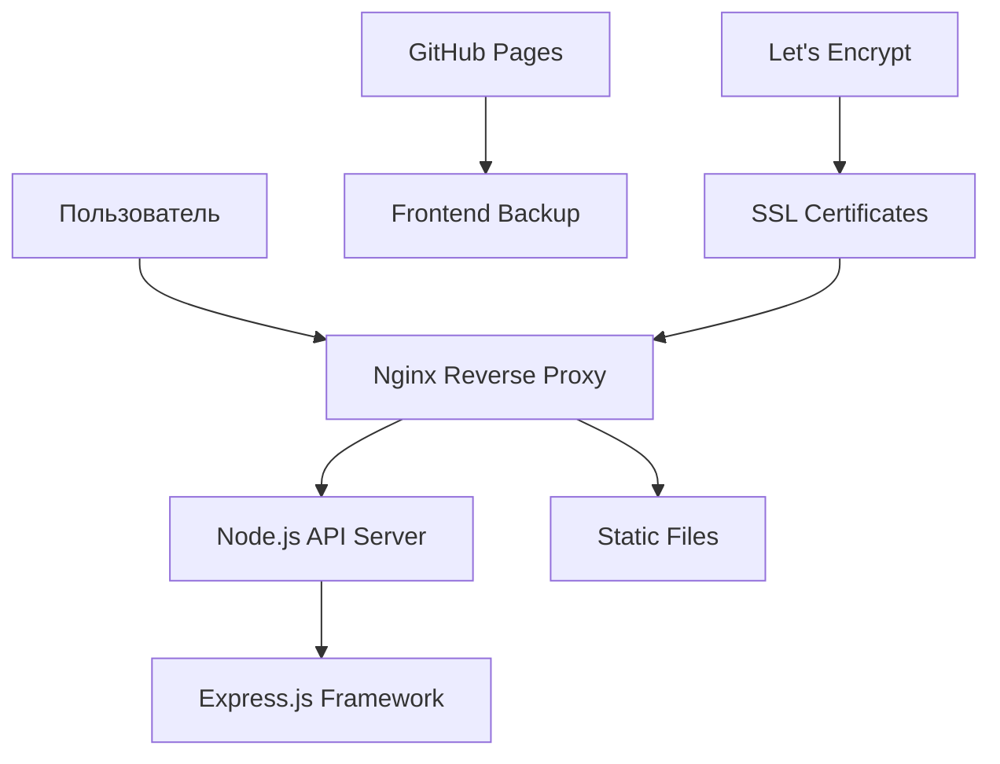

# 📚 ТЕХНИЧЕСКОЕ РУКОВОДСТВО GITA 1972 REPRINT

## 🎯 НАЗНАЧЕНИЕ И ОБЛАСТЬ ПРИМЕНЕНИЯ

**Целевая аудитория:** DevOps инженеры, системные администраторы, разработчики  
**Уровень:** Средний-продвинутый  
**Использование:** Эксплуатация, восстановление, диагностика продакшн среды

---

## 🏗️ АРХИТЕКТУРА СИСТЕМЫ

### Компоненты системы


### Технологический стек
- **Frontend:** HTML, CSS, JavaScript (статические файлы)
- **Backend:** Node.js v20.19.4, Express.js v5.1.0
- **Web Server:** Nginx 1.24.0
- **SSL:** Let's Encrypt (автообновление)
- **Платформа:** Yandex Cloud, Ubuntu 24.04.3 LTS
- **Мониторинг:** systemd, journalctl

---

## 🔧 ОПЕРАЦИОННЫЕ ПРОЦЕДУРЫ

### Ежедневные проверки
```bash
#!/bin/bash
# Скрипт ежедневной проверки
echo "🔍 Daily Health Check $(date)"
echo "=========================="

# Проверка сервисов
systemctl is-active nginx || echo "❌ Nginx DOWN"
systemctl is-active gita-api || echo "⚠️ systemd service inactive"
ps aux | grep "node.*server.js" | grep -v grep || echo "❌ Node.js process DOWN"

# Проверка доступности
curl -s -o /dev/null -w "API Status: %{http_code}\n" https://api.gita-1972-reprint.ru/api/status
curl -s -o /dev/null -w "Main Site: %{http_code}\n" https://gita-1972-reprint.ru/

# Проверка ресурсов
echo "💾 Disk Usage:"
df -h / | awk 'NR==2{print $5 " используется"}'
echo "🧠 Memory Usage:"
free -h | awk 'NR==2{print $3"/"$2 " используется"}'

# Проверка SSL
echo "🔒 SSL Certificate expires:"
echo | openssl s_client -servername api.gita-1972-reprint.ru -connect api.gita-1972-reprint.ru:443 2>/dev/null | openssl x509 -noout -dates | grep notAfter
```

### Еженедельные задачи
```bash
# Обновление системы
sudo apt update && sudo apt upgrade -y

# Проверка логов на ошибки
journalctl -u nginx --since "1 week ago" | grep -i error
journalctl -u gita-api --since "1 week ago" | grep -i error

# Резервное копирование конфигураций
tar -czf ~/backup-$(date +%Y%m%d).tar.gz \
  /etc/nginx/sites-available/ \
  /etc/systemd/system/gita-api.service \
  ~/gita-1972/
```

---

## 🚨 ЭКСТРЕННЫЕ ПРОЦЕДУРЫ

### API сервер не отвечает

**Диагностика:**
```bash
# 1. Проверка процессов
ps aux | grep node
sudo systemctl status gita-api

# 2. Проверка портов
sudo ss -tulpn | grep :3000

# 3. Проверка логов
journalctl -u gita-api -n 50
tail -f /var/log/nginx/error.log
```

**Восстановление:**
```bash
# Метод 1: Перезапуск через systemd
sudo systemctl restart gita-api

# Метод 2: Ручной запуск (если systemd не работает)
pkill -f "node.*server.js"
cd /home/yc-user/gita-1972
nohup node src/server.js > /tmp/api.log 2>&1 &

# Метод 3: Полное восстановление
cd /home/yc-user/gita-1972
npm install
node src/server.js &
```

### Nginx не запускается

**Диагностика:**
```bash
# Проверка конфигурации
sudo nginx -t

# Проверка портов
sudo ss -tulpn | grep :80
sudo ss -tulpn | grep :443

# Проверка SSL сертификатов
sudo ls -la /etc/letsencrypt/live/*/
```

**Восстановление:**
```bash
# Исправление прав на SSL
sudo chown -R root:root /etc/letsencrypt/
sudo chmod -R 755 /etc/letsencrypt/live/
sudo chmod -R 644 /etc/letsencrypt/live/*/

# Перезапуск Nginx
sudo systemctl restart nginx
```

### SSL сертификаты истекли

**Диагностика:**
```bash
# Проверка статуса certbot
sudo certbot certificates

# Проверка cron задач
sudo crontab -l | grep certbot
```

**Обновление:**
```bash
# Ручное обновление
sudo certbot renew --dry-run
sudo certbot renew
sudo systemctl reload nginx
```

---

## 📋 СТАНДАРТНЫЕ ОПЕРАЦИИ

### Развёртывание обновлений

**Frontend обновления:**
```bash
# 1. Подключение к серверу
yc compute ssh --id fhmmuttj78nf215noffh --identity-file ~/.ssh/ssh-key-1753182147967 --login yc-user

# 2. Резервное копирование
cp -r ~/gita-1972/public ~/backup-public-$(date +%Y%m%d)

# 3. Обновление файлов
cd ~/gita-1972
git pull origin main

# 4. Перезапуск (если нужно)
sudo systemctl reload nginx
```

**Backend обновления:**
```bash
# 1. Остановка сервиса
pkill -f "node.*server.js"

# 2. Обновление кода
cd ~/gita-1972
git pull origin main

# 3. Установка зависимостей
npm install

# 4. Запуск
node src/server.js &

# 5. Проверка
curl http://localhost:3000/api/status
```

### Мониторинг производительности

**Системные метрики:**
```bash
# CPU и память
top -n 1 -b | head -20

# Дисковое пространство
df -h

# Сетевые соединения
ss -tuln

# Процессы Node.js
ps aux | grep node
```

**Логи приложения:**
```bash
# Nginx логи
tail -f /var/log/nginx/access.log
tail -f /var/log/nginx/error.log

# systemd логи
journalctl -u gita-api -f

# Логи приложения (если настроены)
tail -f /tmp/api.log
```

---

## 🔍 ДИАГНОСТИЧЕСКИЕ КОМАНДЫ

### Проверка здоровья системы
```bash
# Полная диагностика
echo "=== SYSTEM HEALTH CHECK ==="
echo "Date: $(date)"
echo "Uptime: $(uptime)"
echo ""

echo "=== SERVICES STATUS ==="
systemctl is-active nginx && echo "✅ Nginx: Running" || echo "❌ Nginx: Failed"
systemctl is-active gita-api && echo "✅ systemd: Running" || echo "⚠️ systemd: Not active"
ps aux | grep "node.*server.js" | grep -v grep && echo "✅ Node.js: Running" || echo "❌ Node.js: Not running"
echo ""

echo "=== NETWORK TESTS ==="
curl -s -o /dev/null -w "API Health: %{http_code} (%{time_total}s)\n" https://api.gita-1972-reprint.ru/api/status
curl -s -o /dev/null -w "Main Site: %{http_code} (%{time_total}s)\n" https://gita-1972-reprint.ru/
echo ""

echo "=== RESOURCE USAGE ==="
df -h / | awk 'NR==2{printf "Disk: %s used of %s (Free: %s)\n", $3, $2, $4}'
free -h | awk 'NR==2{printf "Memory: %s used of %s\n", $3, $2}'
echo ""

echo "=== SSL STATUS ==="
echo | openssl s_client -servername api.gita-1972-reprint.ru -connect api.gita-1972-reprint.ru:443 2>/dev/null | openssl x509 -noout -dates | grep notAfter | cut -d= -f2
```

### Анализ производительности
```bash
# Топ процессов по CPU
ps aux --sort=-%cpu | head -10

# Топ процессов по памяти  
ps aux --sort=-%mem | head -10

# I/O статистика
iostat -x 1 5

# Сетевая статистика
netstat -i
```

---

## 🔒 БЕЗОПАСНОСТЬ И ДОСТУП

### SSH подключение
```bash
# Рекомендуемый способ (Yandex Cloud CLI)
yc compute ssh \
  --id fhmmuttj78nf215noffh \
  --identity-file ~/.ssh/ssh-key-1753182147967 \
  --login yc-user

# Альтернативный способ (прямой SSH)
ssh -i ~/.ssh/ssh-key-1753182147967 yc-user@46.21.247.218
```

### Файлы конфигурации
```bash
# Nginx конфигурация
/etc/nginx/sites-available/default
/etc/nginx/nginx.conf

# systemd сервис
/etc/systemd/system/gita-api.service

# SSL сертификаты
/etc/letsencrypt/live/api.gita-1972-reprint.ru/
/etc/letsencrypt/live/gita-1972-reprint.ru/

# Приложение
/home/yc-user/gita-1972/
```

### Резервное копирование
```bash
# Создание полного бэкапа
tar -czf ~/full-backup-$(date +%Y%m%d).tar.gz \
  /etc/nginx/ \
  /etc/systemd/system/gita-api.service \
  /home/yc-user/gita-1972/ \
  /etc/letsencrypt/

# Восстановление из бэкапа
tar -xzf ~/full-backup-YYYYMMDD.tar.gz -C /
sudo systemctl daemon-reload
sudo systemctl restart nginx gita-api
```

---

## 📞 ЭСКАЛАЦИЯ И КОНТАКТЫ

### Уровни поддержки

**Уровень 1: Автоматическое восстановление**
- Скрипты мониторинга
- systemd автоперезапуск
- Nginx автовосстановление

**Уровень 2: Операционная поддержка**
- Ручной перезапуск сервисов
- Диагностика логов
- Базовые исправления конфигурации

**Уровень 3: Экспертная поддержка**
- Глубокая диагностика системы
- Восстановление из резервных копий
- Изменения архитектуры

### Контактная информация
- **Техническая поддержка:** Cursor AI Assistant
- **Облачная платформа:** Yandex Cloud Console
- **Экстренные случаи:** Восстановление по данному руководству

---

## 📊 МЕТРИКИ И SLA

### Целевые показатели
- **Доступность:** 99.9% (не более 8.76 часов простоя в год)
- **Время отклика:** < 2 секунды для API endpoints
- **Время восстановления:** < 30 минут для критических инцидентов

### Мониторинг метрик
```bash
# Время отклика API
curl -w "@curl-format.txt" -o /dev/null -s https://api.gita-1972-reprint.ru/api/status

# Создание файла curl-format.txt
cat > curl-format.txt << 'EOF'
     time_namelookup:  %{time_namelookup}\n
        time_connect:  %{time_connect}\n
     time_appconnect:  %{time_appconnect}\n
    time_pretransfer:  %{time_pretransfer}\n
       time_redirect:  %{time_redirect}\n
  time_starttransfer:  %{time_starttransfer}\n
                     ----------\n
          time_total:  %{time_total}\n
EOF
```

---

## 🔄 ИЗМЕНЕНИЯ И ВЕРСИОНИРОВАНИЕ

**Версия документа:** 1.0  
**Дата создания:** 26 августа 2025  
**Последнее обновление:** 26 августа 2025  
**Следующий пересмотр:** 26 сентября 2025

### История изменений
| Версия | Дата | Изменения | Автор |
|--------|------|-----------|-------|
| 1.0 | 26.08.2025 | Первичная версия после восстановления | AI Assistant |

---

## 📚 ДОПОЛНИТЕЛЬНЫЕ РЕСУРСЫ

### Связанная документация
- `PRODUCTION_RECOVERY_REPORT.md` - Отчёт о последнем восстановлении
- `README.md` - Общее описание проекта
- `deployment/README.md` - Инструкции по развёртыванию

### Полезные ссылки
- [Nginx Documentation](https://nginx.org/en/docs/)
- [Node.js Best Practices](https://nodejs.org/en/docs/guides/)
- [systemd Service Management](https://www.freedesktop.org/software/systemd/man/systemd.service.html)
- [Let's Encrypt Documentation](https://letsencrypt.org/docs/)

---

*Этот документ является живым и должен обновляться при любых изменениях в системе или процедурах.*
